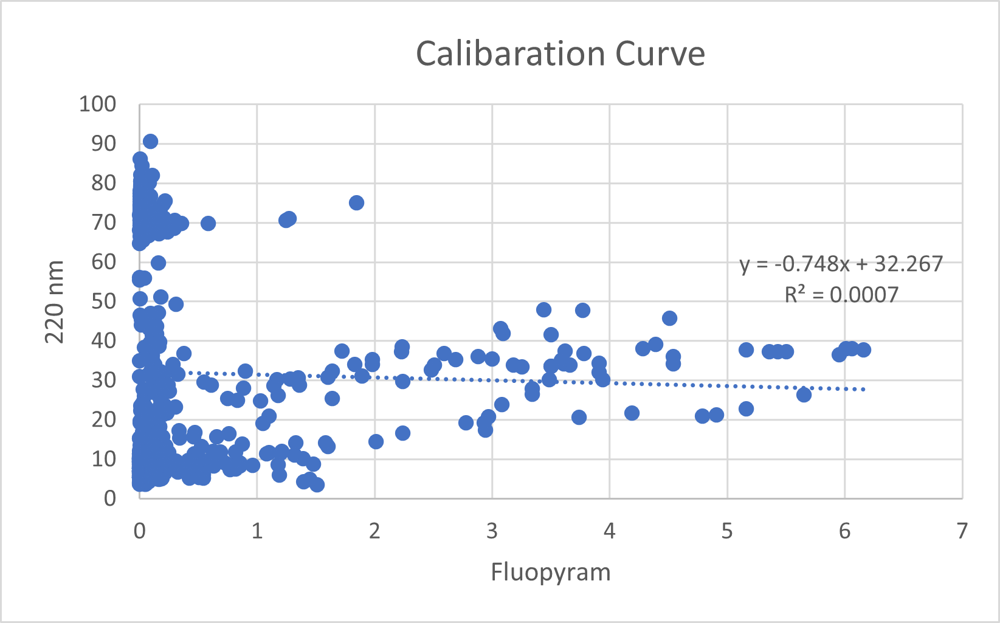
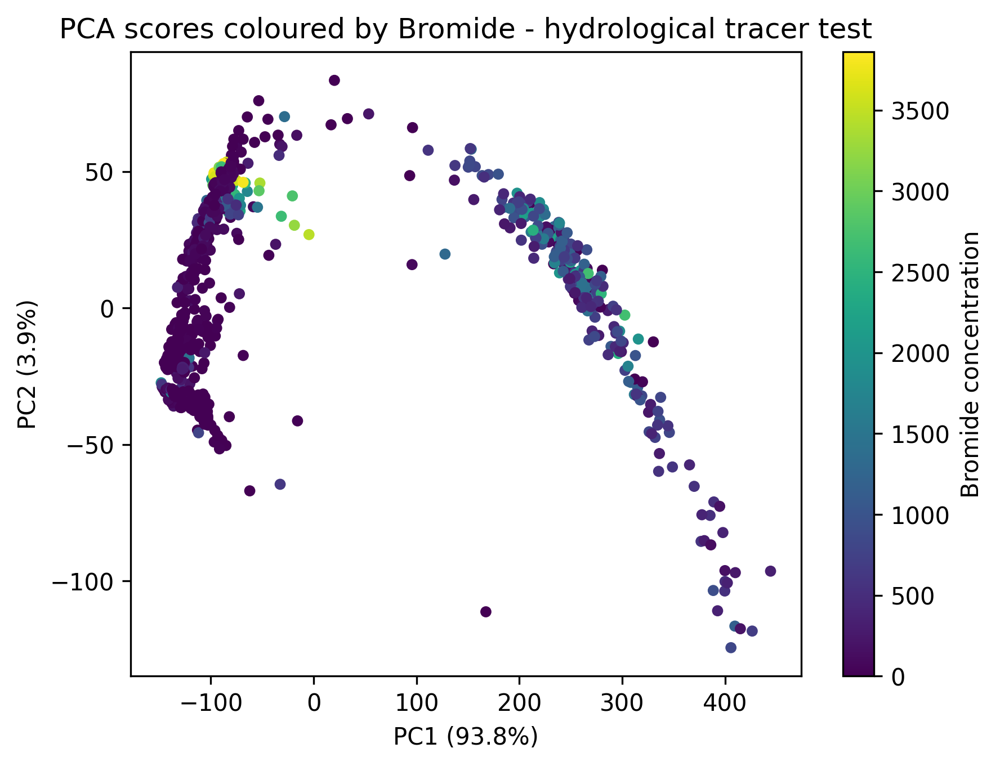
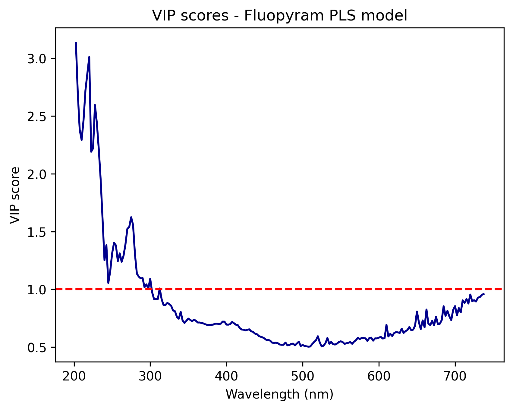

<h1 align="center">Data Analysis Portfolio</h1>
<h3 align="center">Ubaid Ur Rahman — Analytical Data Analyst</h3>

  
  
  
  

---

## About Me

I'm **Ubaid Ur Rahman**, a final-year BS Chemistry student (CGPA 3.84/4.0) and a **Google Certified Data Analyst**.

My background in analytical chemistry means I work with real, precise, and often messy data every day — spectroscopic readings, calibration curves, quality control measurements. I apply that same precision mindset to **SQL, Excel, Power BI, and Chemometrics** to clean data, find patterns, and turn numbers into clear answers.

> *"A spec sheet and a dataset aren't that different when you're looking for what's off."*

---

## Skills

| Category | Tools & Methods |
|---|---|
| 🗄️ Database & Query | SQL · SQLite |
| 📊 Spreadsheet Analysis | Excel (Pivot Tables · VLOOKUP · LINEST · Charts) |
| 📈 Visualisation | Power BI |
| 🔬 Chemometrics | PLS Regression · OLS Regression · Calibration Curves · LOD/LOQ · VIP Scores |
| 🐍 Programming | Python · pandas · scikit-learn *(beginner)* |
| 🧪 Domain Knowledge | Analytical Chemistry · UV-Vis Spectroscopy · Statistical QC |

---

## Projects

---

## 1. 🌿 UV-Vis Pesticide Detection — Chemometric Data Analysis

**Repository:** [uv-vis-pesticide-chemometrics](https://github.com/ur-chemist/uv-vis-pesticide-chemometrics)
**Dataset DOI:** [10.5281/zenodo.21911163](https://doi.org/10.5281/zenodo.21911163)

### Project Summary

Analysed 846 UV-Vis spectra (200–737.5 nm) collected from complex environmental
water samples to detect and quantify four pesticide analytes. The project compared
univariate (Beer-Lambert) and multivariate (PLS, PLS+SNV) methods to understand
which approach handles real-world matrix interference better.

This is a negative-result study — one analyte was confirmed undetectable due to
dissolved organic matter (DOM) interference. That finding is the result, and it
matters as much as a positive one.

### The Problem

Standard univariate calibration fails when multiple compounds overlap in the same
spectral region. The question was: can PLS regression recover individual analyte
signals from a complex, overlapping mixture?

### What I Did

- Loaded and cleaned 846 spectra — removed NaN columns, sorted by analyte concentration
- Built calibration curves for all 4 analytes using LINEST (Excel) and Beer-Lambert law
- Calculated LOD and LOQ for each analyte
- Built a selectivity table using CORREL across 5 key wavelengths
- Ran PLS and PLS+SNV models with 5-fold cross-validation, 10 components
- Analysed VIP scores to identify which wavelength regions actually contribute

### Results

| Analyte | Univariate R²cv | PLS R²cv | PLS+SNV R²cv |
|---|---|---|---|
| Fluopyram | −0.004 | 0.41 | **0.597** |
| Bromide | 0.31 | 0.58 | **0.627** |
| Diflufenican | ~0.00 | ~0.00 | ~0.002 |
| Mesosulfuron | — | — | — |

**Key Finding:** Diflufenican is undetectable across all models — DOM matrix
interference confirmed. VIP scores show only 202–300 nm contributes meaningfully
to the Fluopyram model.

### Skills Demonstrated

- Multivariate Data Analysis (PLS · PLS+SNV)
- Spectral Data Cleaning & Preprocessing
- Calibration Curve Construction (LINEST)
- LOD / LOQ Calculation
- Cross-Validation & Model Evaluation
- Scientific Data Reporting (honest negative results)
- Excel Advanced Functions
- Python (pandas · scikit-learn)

### Tools

`Excel` `Python` `pandas` `scikit-learn` `Zenodo` `UV-Vis Spectral Data`

### Screenshots

> 📸 *Calibration curves*
> 

> 📸 *PCA SCORE*
> 

> 📸 *VIP scores plot*
> 

---

## 2. 🍷 Wine Quality — Data Analysis & Classification

**Repository:** [wine-quality-chemometrics](https://github.com/ur-chemist/wine-quality-chemometrics)

### Project Summary

Analysed 1,599 red wine samples from the UCI Wine Quality dataset to identify
which chemical properties drive quality scores. Built a regression model, a
classification pipeline, and a SQL database to store and query predictions.

### The Problem

Can measurable physicochemical properties — acidity, alcohol, sulphates — predict
wine quality reliably? And which features matter most?

### What I Did

- Loaded and explored 1,599 rows × 11 chemical features
- Analysed distributions, outliers, and feature correlations
- Built an OLS regression model to quantify each feature's impact on quality
- Classified wines as good (quality ≥ 7) vs average using Random Forest
- Stored all predictions in a SQLite database
- Wrote SQL queries to filter, sort, and summarise results by quality tier

### Results

| Method | Result |
|---|---|
| OLS Regression R² | 0.32 |
| Random Forest Accuracy | ~78% on test set |
| Strongest positive driver | Alcohol content |
| Strongest negative driver | Volatile acidity |

**Honest note:** R² of 0.32 reflects that wine quality ratings are partly
subjective human scores — not a flaw in the analysis. The value here is in
the data pipeline, SQL workflow, and feature interpretation.

### Skills Demonstrated

- Exploratory Data Analysis (EDA)
- OLS Regression & Feature Significance (p-values)
- Random Forest Classification
- SQL Database Design & Querying (SQLite)
- Data Cleaning with pandas
- Jupyter Notebook Documentation

### Tools

`Python` `pandas` `scikit-learn` `statsmodels` `SQLite` `SQL` `Jupyter` `Excel`

### Screenshots

> 📸 *Feature correlation heatmap — add your screenshot here*
> 

> 📸 *Regression results summary — add your screenshot here*
> 

> 📸 *Random Forest feature importance — add your screenshot here*
> 

---

## 3. 🛒 E-Commerce Sales Analysis *(In Progress)*

**Dataset:** [E-Commerce Sales Analytics — Kaggle](https://www.kaggle.com/datasets/datascikhan/e-commerce-sales-and-customer-analytics)
*(150,000+ transactions · 2021–2025 · Updated September 2026)*

### Project Summary

Analysing 150,000+ e-commerce transactions to answer real business questions
about sales performance, customer behaviour, product profitability, and seasonal
trends — using SQL for querying and Power BI for dashboards.

### Questions I Am Answering

- Which product categories generate the most revenue and profit?
- Which months have the highest and lowest sales? (seasonal trends)
- Do discounts increase revenue or hurt profit margins?
- Which customer segments have the highest return rates?
- What are the top 10 products by profit margin?

### Planned Deliverables

- [ ] SQL queries for all 5 business questions
- [ ] Excel pivot table summary
- [ ] Power BI dashboard with KPI cards and filters
- [ ] Written findings — plain English, no jargon

### Tools

`SQL` `Excel` `Power BI`

---

## Certifications

| Certificate | Issuer | Completed | Verify |
|---|---|---|---|
| Google Data Analytics Professional | Google / Coursera | Dec 1, 2025 | [Verify](https://coursera.org/verify/professional-cert/98TNBN2M2XU6) |
| Google IT Support | Google / Coursera | 2025 | — |

---

## Contact

I am open to **remote Data Analyst roles and freelance projects**.

| Platform | Link |
|---|---|
| 💼 LinkedIn | [linkedin.com/in/ubaid-ur-rehman-chemist](https://www.linkedin.com/in/ubaid-ur-rehman-chemist) |
| 💬 WhatsApp | [+92 322 823 9798](https://wa.me/923228239798) |
| 🔬 ORCID | [0009-0007-8152-5843](https://orcid.org/0009-0007-8152-5843) |
| 🎯 Kaggle | [ubaidurrehmanthaheem](https://www.kaggle.com/ubaidurrehmanthaheem) |

Made from Bahawalnagar, Pakistan 🇵🇰

